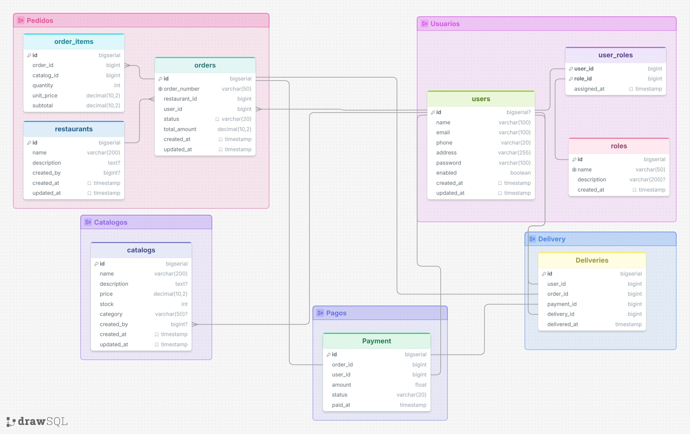

# Configuración de Zipkin para trazas distribuidas## 1: Diagrama de comunicación

```
┌────────────────────────────────────────────────────────────────────────────────────────────────────────┐
│                                                  Localhost                                             │
└────────────────────────────────────────────────────────────────────────────────────────────────────────┘
           ↓                    ↓
    localhost:30081      localhost:30082       localhost:30083    localhost:30084       localhost:30085
           ↓                   ↓                     ↓                  ↓                     ↓
┌──────────▼─────────┐  ┌──────▼───────────┐  ┌──────▼────────┐  ┌──────▼──────────┐  ┌───────▼──────────┐
│  user-service      │←─┤ catalogs-service │←─┤ order-service │←─┤ payment-service │←─┤ delivery-service │
│  Namespace         │  │ Namespace        │  │ Namespace     │  │ Namespace       │  │ Namespace        │
│  (1 pods)          │  │ (1 pods)         │  │ (1 pods)      │  │ (1 pods)        │  │ (1 pods)         │
└────────────────────┘  └──────────────────┘  └───────────────┘  └─────────────────┘  └──────────────────┘
         ↓                       ↓                   ↓                    ↓                    ↓
    PostgreSQL             PostgreSQL            PostgreSQL          PostgreSQL            PostgreSQL
    (port 5433)            (port 5434)           (port 5435)         (port 5436)           (port 5437)
    userdb                 catalogdb              orderdb            paymentdb             deliverydb
```

## 2: Modelo de datos de proyecto final



# users

## Columns

| Name       | Type         | Nullable | Default           | Key | References | Comment |
| ---------- | ------------ | -------- | ----------------- | --- | ---------- | ------- |
| id         | bigserial    | NULL     |                   | PK  |            |         |
| name       | varchar(100) | NOT NULL |                   |     |            |         |
| email      | varchar(100) | NOT NULL |                   |     |            |         |
| phone      | varchar(20)  | NOT NULL |                   |     |            |         |
| address    | varchar(255) | NOT NULL |                   |     |            |         |
| password   | varchar(100) | NOT NULL |                   |     |            |         |
| enabled    | boolean      | NOT NULL |                   |     |            |         |
| created_at | timestamp    | NOT NULL | CURRENT_TIMESTAMP |     |            |         |
| updated_at | timestamp    | NOT NULL | CURRENT_TIMESTAMP |     |            |         |

## Relationships

- user_roles.user_id → id (one-to-one)
- orders.user_id → id (one-to-many)
- catalogs.created_by → id (one-to-many)

# roles

## Columns

| Name        | Type         | Nullable | Default           | Key | References | Comment |
| ----------- | ------------ | -------- | ----------------- | --- | ---------- | ------- |
| id          | bigserial    | NOT NULL |                   | PK  |            |         |
| name        | varchar(50)  | NOT NULL |                   | UQ  |            |         |
| description | varchar(200) | NULL     |                   |     |            |         |
| created_at  | timestamp    | NOT NULL | CURRENT_TIMESTAMP |     |            |         |

## Relationships

- user_roles.role_id → id (one-to-one)

# user_roles

## Columns

| Name        | Type      | Nullable | Default           | Key    | References | Comment |
| ----------- | --------- | -------- | ----------------- | ------ | ---------- | ------- |
| user_id     | bigint    | NOT NULL |                   | PK, FK | users.id   |         |
| role_id     | bigint    | NOT NULL |                   | PK, FK | roles.id   |         |
| assigned_at | timestamp | NOT NULL | CURRENT_TIMESTAMP |        |            |         |

## Relationships

- user_id → users.id (one-to-one)
- role_id → roles.id (one-to-one)

# catalogs

## Columns

| Name        | Type          | Nullable | Default           | Key | References | Comment |
| ----------- | ------------- | -------- | ----------------- | --- | ---------- | ------- |
| id          | bigserial     | NOT NULL |                   | PK  |            |         |
| name        | varchar(200)  | NOT NULL |                   |     |            |         |
| description | text          | NULL     |                   |     |            |         |
| price       | decimal(10,2) | NOT NULL |                   |     |            |         |
| stock       | int           | NOT NULL |                   |     |            |         |
| category    | varchar(50)   | NULL     |                   |     |            |         |
| created_by  | bigint        | NULL     |                   | FK  | users.id   |         |
| created_at  | timestamp     | NOT NULL | CURRENT_TIMESTAMP |     |            |         |
| updated_at  | timestamp     | NOT NULL | CURRENT_TIMESTAMP |     |            |         |

## Relationships

- created_by → users.id (one-to-many)

# restaurants

## Columns

| Name        | Type         | Nullable | Default           | Key | References | Comment |
| ----------- | ------------ | -------- | ----------------- | --- | ---------- | ------- |
| id          | bigserial    | NOT NULL |                   | PK  |            |         |
| name        | varchar(200) | NOT NULL |                   |     |            |         |
| description | text         | NULL     |                   |     |            |         |
| created_by  | bigint       | NULL     |                   |     |            |         |
| created_at  | timestamp    | NOT NULL | CURRENT_TIMESTAMP |     |            |         |
| updated_at  | timestamp    | NOT NULL | CURRENT_TIMESTAMP |     |            |         |

## Relationships

- orders.restaurant_id → id (many-to-one)

# orders

## Columns

| Name          | Type          | Nullable | Default           | Key | References     | Comment |
| ------------- | ------------- | -------- | ----------------- | --- | -------------- | ------- |
| id            | bigserial     | NOT NULL |                   | PK  |                |         |
| order_number  | varchar(50)   | NOT NULL |                   | UQ  |                |         |
| restaurant_id | bigint        | NOT NULL |                   | FK  | restaurants.id |         |
| user_id       | bigint        | NOT NULL |                   | FK  | users.id       |         |
| status        | varchar(20)   | NOT NULL | PENDING           |     |                |         |
| total_amount  | decimal(10,2) | NOT NULL | 0                 |     |                |         |
| created_at    | timestamp     | NOT NULL | CURRENT_TIMESTAMP |     |                |         |
| updated_at    | timestamp     | NOT NULL | CURRENT_TIMESTAMP |     |                |         |

## Relationships

- restaurant_id → restaurants.id (many-to-one)
- user_id → users.id (one-to-many)
- Payment.order_id → id (one-to-one)
- order_items.order_id → id (many-to-one)

# order_items

## Columns

| Name       | Type          | Nullable | Default | Key | References | Comment |
| ---------- | ------------- | -------- | ------- | --- | ---------- | ------- |
| id         | bigserial     | NOT NULL |         | PK  |            |         |
| order_id   | bigint        | NOT NULL |         | FK  | orders.id  |         |
| catalog_id | bigint        | NOT NULL |         |     |            |         |
| quantity   | int           | NOT NULL |         |     |            |         |
| unit_price | decimal(10,2) | NOT NULL |         |     |            |         |
| subtotal   | decimal(10,2) | NOT NULL |         |     |            |         |

## Relationships

- order_id → orders.id (many-to-one)

# Payment

## Columns

| Name     | Type        | Nullable | Default | Key | References | Comment |
| -------- | ----------- | -------- | ------- | --- | ---------- | ------- |
| id       | bigserial   | NOT NULL |         | PK  |            |         |
| order_id | bigint      | NOT NULL |         | FK  | orders.id  |         |
| amount   | float       | NOT NULL |         |     |            |         |
| status   | varchar(20) | NOT NULL |         |     |            |         |
| paid_at  | timestamp   | NOT NULL |         |     |            |         |

## Relationships

- order_id → orders.id (one-to-one)

# Deliveries

## Columns

| Name         | Type      | Nullable | Default | Key | References | Comment |
| ------------ | --------- | -------- | ------- | --- | ---------- | ------- |
| id           | bigserial | NOT NULL |         | PK  |            |         |
| user_id      | bigint    | NOT NULL |         | FK  | users.id   |         |
| order_id     | bigint    | NOT NULL |         | FK  | orders.id  |         |
| payment_id   | bigint    | NOT NULL |         | FK  | Payment.id |         |
| delivery_id  | bigint    | NOT NULL |         | FK  | users.id   |         |
| delivered_at | timestamp | NOT NULL |         |     |            |         |

## Relationships

- user_id → users.id (one-to-one)
- order_id → orders.id (one-to-one)
- payment_id → Payment.id (one-to-one)
- delivery_id → users.id (one-to-one)
