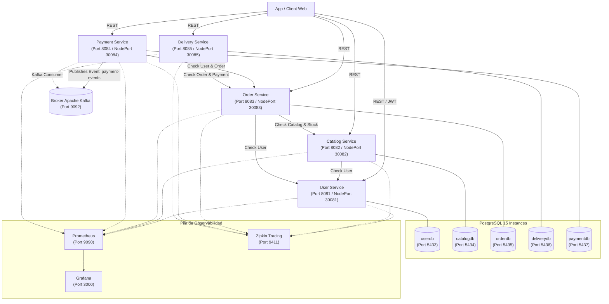
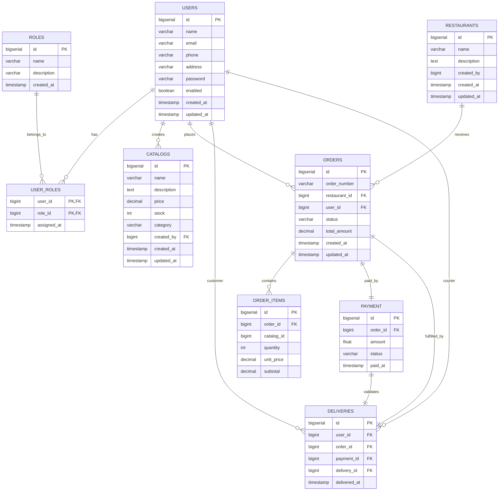

# Sistema de Pedidos de Comida — Arquitectura de Microservicios

Plataforma distribuida de pedidos de comida diseñada bajo los principios de **Arquitectura de Microservicios**, **Clean Architecture / Hexagonal**, **Arquitectura Orientada a Eventos (EDA)** con Apache Kafka y observabilidad integral con Prometheus, Grafana y Zipkin.

---

## 📐 Visión General de la Arquitectura

El sistema está compuesto por **5 microservicios independientes** construidos en Java 17 con Spring Boot 3, cada uno utilizando su propia base de datos PostgreSQL (*Database per Service*). La comunicación sincrónica entre servicios se realiza mediante REST HTTP y la asincrónica a través de eventos de dominio en Apache Kafka.



---

## 🛠️ Tecnologías Utilizadas

- **Lenguaje / Framework**: Java 17, Spring Boot 3, Spring Data JPA, Spring Security.
- **Bases de Datos**: PostgreSQL 15 (Instancias dedicadas por microservicio).
- **Mensajería & Eventos**: Apache Kafka, Zookeeper, Kafka UI.
- **Autenticación**: JSON Web Token (JWT), BCrypt Password Hashing, RBAC.
- **Observabilidad**: Prometheus, Grafana, Micrometer, OpenZipkin.
- **Contenedores & Orquestación**: Docker, Docker Compose, Kubernetes (K8s).

---

## 🌐 Servicios, Puertos y Bases de Datos

| Servicio | Puerto App | NodePort K8s | Base de Datos | Puerto DB | Descripción |
|---|---|---|---|---|---|
| [`user-service`](./user-service) | `8081` | `30081` | `userdb` | `5433` | Usuarios, Autenticación JWT y Roles |
| [`catalogo-service`](./catalogo-service) | `8082` | `30082` | `catalogdb` | `5434` | Catálogo de platillos, precios e inventario |
| [`pedido-service`](./pedido-service) | `8083` | `30083` | `orderdb` | `5435` | Restaurantes, órdenes de compra e ítems |
| [`pago-service`](./pago-service) | `8084` | `30084` | `paymentdb` | `5437` | Procesamiento de pagos y eventos Kafka |
| [`entrega-service`](./entrega-service) | `8085` | `30085` | `deliverydb` | `5436` | Asignación y despacho de entregas |

### Infraestructura y Observabilidad

| Herramienta | Puerto | URL de Acceso | Credenciales por Defecto |
|---|---|---|---|
| **Prometheus** | `9090` | [http://localhost:9090](http://localhost:9090) | Sin autenticación |
| **Grafana** | `3000` | [http://localhost:3000](http://localhost:3000) | User: `admin` / Pass: `admin` |
| **Zipkin UI** | `9411` | [http://localhost:9411](http://localhost:9411) | Sin autenticación |
| **Kafka UI** | `8090` | [http://localhost:8090](http://localhost:8090) | Sin autenticación |
| **Apache Kafka** | `9092` | `localhost:9092` | PLAINTEXT |

---

## 🗄️ Modelo de Datos (Diagrama ER Global)



---

## 🚀 Guía de Inicio Rápido (Quickstart)

### Prerrequisitos
- **Java 17 JDK** instalado.
- **Docker Desktop** y **Docker Compose** en ejecución.
- **Maven** (o usar el wrapper `./mvnw` incluido en cada proyecto).

### 1. Clonar el Repositorio
```bash
git clone <URL_DEL_REPOSITOIO>
cd arq_soft_final
```

### 2. Iniciar Infraestructura con Docker Compose
Levanta las 5 instancias de PostgreSQL, Kafka, Zookeeper, Prometheus, Grafana y Zipkin:

```bash
docker-compose up -d
```

Verifica que todos los contenedores estén sanos:
```bash
docker-compose ps
```

### 3. Compilar y Ejecutar Microservicios

Puedes ejecutar los microservicios localmente con Maven o empaquetarlos como contenedores:

#### Ejecución Local con Maven Wrapper:
```bash
# Terminal 1 - User Service (Port 8081)
cd user-service && ./mvnw spring-boot:run

# Terminal 2 - Catalog Service (Port 8082)
cd catalogo-service && ./mvnw spring-boot:run

# Terminal 3 - Order Service (Port 8083)
cd pedido-service && ./mvnw spring-boot:run

# Terminal 4 - Payment Service (Port 8084)
cd pago-service && ./mvnw spring-boot:run

# Terminal 5 - Delivery Service (Port 8085)
cd entrega-service && ./mvnw spring-boot:run
```

---

## ☸️ Despliegue en Kubernetes (K8s)

Cada microservicio contiene sus manifiestos Kubernetes listos en el directorio `k8s/`:

```bash
# Aplicar infraestructura y deployments para cada servicio
kubectl apply -f user-service/k8s/
kubectl apply -f catalogo-service/k8s/
kubectl apply -f pedido-service/k8s/
kubectl apply -f pago-service/k8s/
kubectl apply -f entrega-service/k8s/

# Verificar el estado de los recursos desplegados
kubectl get pods,svc,configmaps,secrets -n default
```

Los servicios quedarán expuestos a través de **NodePorts** (`30081` a `30085`).

---

## 📋 Matriz de Endpoints Principal de la API REST

### Autenticación y Usuarios (`user-service`: 8081)
- `POST /api/v1/auth/register` — Registrar un nuevo usuario.
- `POST /api/v1/auth/login` — Autenticar y obtener JWT Bearer Token.
- `GET /api/v1/users` — Listar usuarios.
- `GET /api/v1/users/{id}` — Consultar usuario por ID.

### Catálogo de Productos (`catalogo-service`: 8082)
- `GET /api/v1/catalogs` — Listar menú/productos.
- `POST /api/v1/catalogs` — Registrar platillo (Requiere rol RESTAURANT/ADMIN).
- `PATCH /api/v1/catalogs/{id}/stock` — Actualizar stock de inventario.

### Pedidos (`pedido-service`: 8083)
- `POST /api/v1/restaurants` — Registrar restaurante.
- `POST /api/v1/orders` — Crear pedido (Valida cliente y catálogo, descuenta stock).
- `GET /api/v1/orders/{id}` — Consultar estado de pedido.
- `PATCH /api/v1/orders/{id}/status` — Cambiar estado del pedido.

### Pagos (`pago-service`: 8084)
- `POST /api/v1/payments` — Procesar pago (Valida orden y emite evento en Kafka).
- `GET /api/v1/payments/order/{orderId}` — Consultar comprobante de pago por orden.

### Entregas (`entrega-service`: 8085)
- `POST /api/v1/deliveries` — Asignar pedido pagado a repartidor.
- `PUT /api/v1/deliveries/{id}/status` — Actualizar estado del despacho (IN_TRANSIT, DELIVERED).

---

## 📄 Documentación Completa de Arquitectura

Para un desglose profundo de los principios de diseño, patrones DDD, seguridad, estrategias de resiliencia y diagramas de secuencia detallados, consulte el [**Documento de Arquitectura de Software (`TrabajoFinal_Arquitectura_Microservicios_Pedidos_Comida.md`)**](./TrabajoFinal_Arquitectura_Microservicios_Pedidos_Comida.md).
