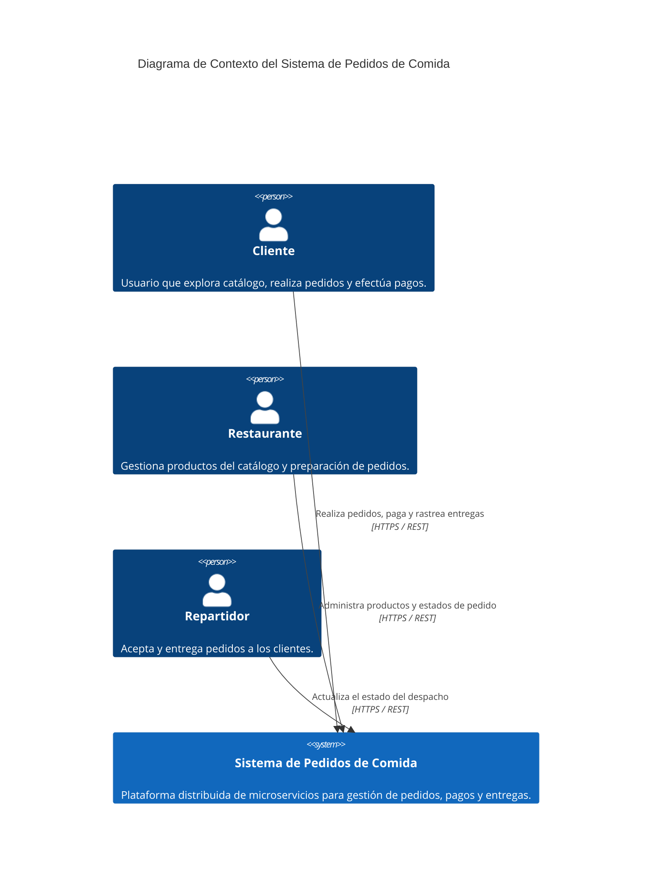
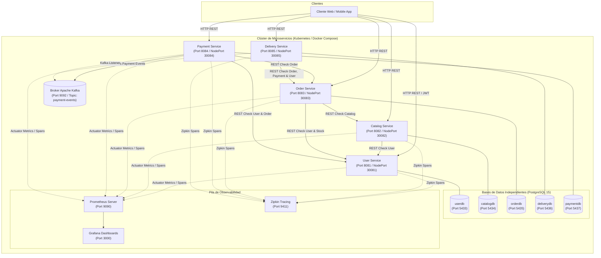
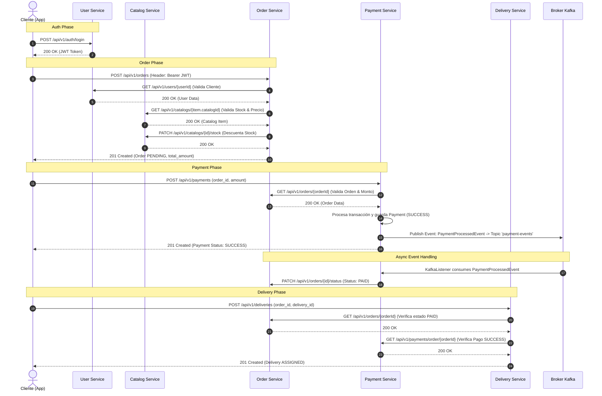
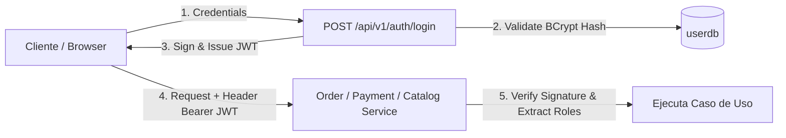
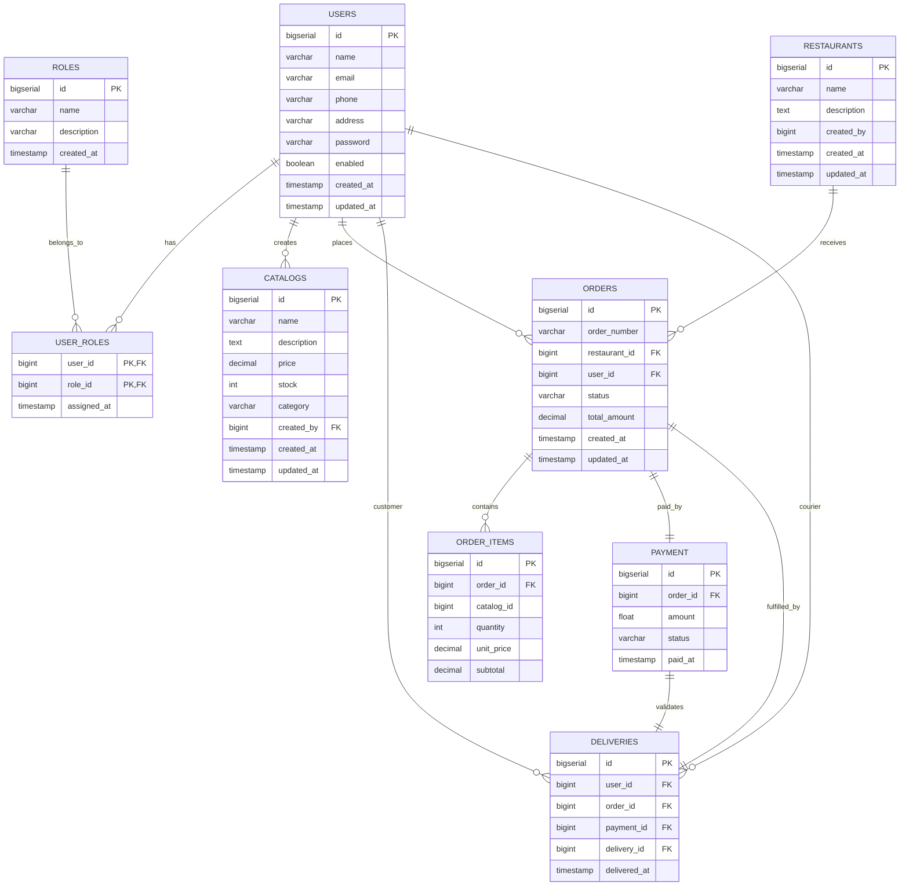

# Documento de Arquitectura de Software – Sistema de Pedidos de Comida

**Curso:** Arquitectura de Software  
**Institución:** Tecsup  
**Versión:** 1.1  
**Estado:** Documento Final de Arquitectura  

---

## 1. Introducción General

### 1.1 Propósito del documento
El presente Documento de Arquitectura de Software (SAD por sus siglas en inglés) describe formalmente la visión arquitectónica, la estructura de componentes, los patrones de diseño, las estrategias de integración, la seguridad y los aspectos operacionales del **Sistema de Pedidos de Comida basado en Microservicios**. 

Este documento sirve como referencia técnica central para arquitectos de software, desarrolladores backend, ingenieros DevOps y miembros del equipo de calidad (QA), facilitando la comprensión homogénea del sistema, su mantenibilidad a largo plazo y la evolución de su infraestructura.

### 1.2 Alcance del sistema
El sistema gestiona de manera distribuida el ciclo de vida completo de un pedido de comida en línea. Sus capacidades principales incluyen:
- **Gestión de Usuarios y Autenticación**: Registro de clientes, restaurantes y repartidores, así como autenticación centralizada mediante JSON Web Tokens (JWT) y control de acceso basado en roles (RBAC).
- **Gestión de Catálogo de Productos**: Mantenimiento de platillos, precios, stock disponible y categorías asociadas a cada restaurante.
- **Gestión de Pedidos**: Registro de órdenes de compra, cálculo de totales, validación de inventario y seguimiento del estado del pedido (PENDING, PAID, IN_PREPARATION, READY_FOR_PICKUP, IN_DELIVERY, DELIVERED, CANCELLED).
- **Procesamiento de Pagos**: Registro de transacciones financieras vinculadas a pedidos, validación de estado de pago y publicación de eventos asíncronos en Apache Kafka.
- **Coordinación de Entregas**: Asignación de personal de delivery a pedidos pagados y seguimiento del despacho hasta la entrega efectiva al cliente.
- **Observabilidad Integrada**: Métricas distribuida en tiempo real (Prometheus/Grafana) y trazabilidad distribuida de solicitudes HTTP (Zipkin).

### 1.3 Audiencia y nivel técnico esperado
Este documento está diseñado para:
- **Arquitectos de Software**: Para evaluar las decisiones de diseño, patrones DDD/Hexagonal y contratos entre componentes.
- **Desarrolladores Backend (Java / Spring Boot)**: Para entender el encapsulamiento por capas y el uso de clientes HTTP (RestTemplate) y mensajería (Kafka).
- **Ingenieros DevOps / SRE**: Para operar la plataforma localmente mediante Docker Compose o desplegarla en un clúster Kubernetes utilizando manifiestos YAML y Helm.
- **Evaluadores / Docentes**: Para comprobar el cumplimiento de los estándares de arquitectura empresarial requeridos en el curso.

---

## 2. Visión Arquitectónica General

### 2.1 Estilo arquitectónico utilizado
El sistema implementa una **Arquitectura de Microservicios Descentralizada y Orientada a Eventos (EDA)**. Cada microservicio representa un *Bounded Context* (Contexto Delimitado) autónomo e independiente:
1. **Despliegue Independiente**: Cada servicio se empaqueta como un contenedor Docker aislado.
2. **Database per Service**: Cada microservicio administra de manera exclusiva su propia instancia/base de datos PostgreSQL.
3. **Comunicación Híbrida**: 
   - **Sincrónica (REST / HTTP)**: Para consultas directas y validaciones punto a punto entre dominios.
   - **Asincrónica (Event-Driven via Apache Kafka)**: Para propagación de eventos del dominio (e.g., confirmación y rechazo de pagos) desacoplando la ejecución en tiempo real.
4. **Arquitectura Hexagonal (Puertos y Adaptadores)**: Implementada internamente en cada microservicio para separar las reglas de negocio de la infraestructura y frameworks.

### 2.2 Decisiones arquitectónicas clave

| ID Decision | Decisión Arquitectónica | Razón y Rationale | Impacto en el Sistema |
|---|---|---|---|
| **ADR-01** | Database per Service | Evitar el acoplamiento a nivel de esquema de base de datos. | Cada microservicio tiene su propio PostgreSQL en puerto/DB dedicado. |
| **ADR-02** | Autenticación basada en JWT | Permitir autenticación stateless scalable en microservicios sin guardar sesión en servidor. | `user-service` firma tokens; otros servicios los verifican en solicitudes HTTP. |
| **ADR-03** | Comunicación asíncrona con Apache Kafka | Garantizar el desacoplamiento de transacciones entre Pago, Pedido y Entrega. | `pago-service` publica en el tópico `payment-events` consumido por handlers asíncronos. |
| **ADR-04** | Tracing distribuido con Zipkin & Micrometer | Permitir el rastreo continuo de peticiones HTTP a través de múltiples microservicios mediante `traceId` y `spanId`. | Diagnóstico rápido de latencia y visibilidad completa del flujo entre servicios. |
| **ADR-05** | Orquestación con Kubernetes | Permitir auto-recuperación (liveness/readiness probes) y escalado horizontal (HPA). | Manifiestos K8s configurados con Namespace, ConfigMap, Secret, Deployment y Service (NodePort). |

### 2.3 Diagramas de alto nivel

#### Diagrama de Contexto (C4 Nivel 1)


#### Diagrama de Contenedores (C4 Nivel 2)


---

## 3. Componentes del Sistema

### 3.1 Módulos principales y responsabilidades

El sistema está dividido en **5 microservicios backend** construidos en Java 17 con Spring Boot 3:

1. **`user-service` (Servicio de Usuarios y Autenticación)**
   - **Responsabilidad**: Gestión de cuentas de usuario, asignación de roles (`ROLE_USER`, `ROLE_ADMIN`, `ROLE_RESTAURANT`, `ROLE_DELIVERY`), cifrado de contraseñas con BCrypt y emisión/validación de firmas JWT.
   - **Base de Datos**: `userdb` (Tablas: `users`, `roles`, `user_roles`).

2. **`catalogo-service` (Servicio de Catálogo)**
   - **Responsabilidad**: Gestión de productos (platillos/menús), precios, categorías y stock de inventario. Validar la existencia del usuario propietario/creador.
   - **Base de Datos**: `catalogdb` (Tabla: `catalogs`).

3. **`pedido-service` (Servicio de Pedidos)**
   - **Responsabilidad**: Gestión de restaurantes y órdenes de compra (`orders`, `order_items`), cálculo de montos totales, reservación/descuento de stock en catálogo y máquina de estados del pedido.
   - **Base de Datos**: `orderdb` (Tablas: `restaurants`, `orders`, `order_items`).

4. **`pago-service` (Servicio de Pagos)**
   - **Responsabilidad**: Procesamiento financiero de pedidos, validación de montos con `pedido-service`, generación de registros de pago y publicación de eventos de dominio (`PaymentProcessedEvent`, `PaymentRejectedEvent`) en Apache Kafka.
   - **Base de Datos**: `paymentdb` (Tabla: `payments`).

5. **`entrega-service` (Servicio de Entregas)**
   - **Responsabilidad**: Coordinación del envío de pedidos pagados, asignación de repartidor, validación de pago previo y actualización del estado del despacho (`ASSIGNED`, `IN_TRANSIT`, `DELIVERED`, `FAILED`).
   - **Base de Datos**: `deliverydb` (Tabla: `deliveries`).

### 3.2 Interfaces y APIs expuestas

#### Matriz Global de Endpoints REST

| Microservicio | Método | Ruta HTTP | Descripción | Permisos / Roles |
|---|---|---|---|---|
| **User** | `POST` | `/api/v1/auth/register` | Registrar nuevo usuario | Público |
| **User** | `POST` | `/api/v1/auth/login` | Autenticar y obtener Token JWT | Público |
| **User** | `GET` | `/api/v1/users` | Listar todos los usuarios | Autenticado |
| **User** | `GET` | `/api/v1/users/{id}` | Obtener detalle de usuario por ID | Autenticado |
| **User** | `GET` | `/api/v1/users/email/{email}` | Obtener usuario por Email | Autenticado |
| **User** | `POST` | `/api/v1/users` | Crear un usuario directamente | Admin |
| **User** | `PUT` | `/api/v1/users/{id}` | Actualizar datos de usuario | Autenticado |
| **User** | `DELETE` | `/api/v1/users/{id}` | Desactivar / Eliminar usuario | Admin |
| **Catalogo** | `GET` | `/api/v1/catalogs` | Consultar catálogo completo | Público |
| **Catalogo** | `GET` | `/api/v1/catalogs/{id}` | Obtener item del catálogo | Público |
| **Catalogo** | `GET` | `/api/v1/catalogs/category/{cat}` | Filtrar productos por categoría | Público |
| **Catalogo** | `POST` | `/api/v1/catalogs` | Registrar producto (Valida User) | Restaurant / Admin |
| **Catalogo** | `PUT` | `/api/v1/catalogs/{id}` | Actualizar producto | Restaurant / Admin |
| **Catalogo** | `PATCH` | `/api/v1/catalogs/{id}/stock` | Actualizar inventario/stock | Restaurant / Admin |
| **Catalogo** | `DELETE` | `/api/v1/catalogs/{id}` | Eliminar producto | Restaurant / Admin |
| **Pedido** | `POST` | `/api/v1/restaurants` | Registrar un restaurante | Admin |
| **Pedido** | `GET` | `/api/v1/restaurants` | Listar restaurantes | Público |
| **Pedido** | `POST` | `/api/v1/orders` | Crear nuevo pedido (Valida User y Catalog) | User |
| **Pedido** | `GET` | `/api/v1/orders` | Listar todos los pedidos | Admin |
| **Pedido** | `GET` | `/api/v1/orders/{id}` | Obtener detalle de pedido por ID | Autenticado |
| **Pedido** | `GET` | `/api/v1/orders/user/{userId}`| Obtener pedidos de un cliente | Autenticado |
| **Pedido** | `PATCH` | `/api/v1/orders/{id}/status` | Cambiar estado del pedido | Autenticado / Interno |
| **Pago** | `POST` | `/api/v1/payments` | Procesar pago (Valida Order y User, publica evento Kafka) | User |
| **Pago** | `GET` | `/api/v1/payments/{id}` | Consultar pago por ID | Autenticado |
| **Pago** | `GET` | `/api/v1/payments/order/{orderId}`| Consultar pago por ID de orden | Autenticado |
| **Pago** | `PUT` | `/api/v1/payments/{id}/status`| Actualizar estado de pago | Admin / Interno |
| **Entrega** | `POST` | `/api/v1/deliveries` | Asignar entrega (Valida Order, Payment, Delivery User) | Admin / Delivery |
| **Entrega** | `GET` | `/api/v1/deliveries/{id}` | Consultar entrega por ID | Autenticado |
| **Entrega** | `GET` | `/api/v1/deliveries/order/{orderId}`| Consultar entrega por Orden | Autenticado |
| **Entrega** | `PUT` | `/api/v1/deliveries/{id}/status`| Actualizar estado de entrega | Delivery / Admin |

### 3.3 Comunicación entre componentes

#### Flujo Sincrónico y Asincrónico de Compra (Diagrama de Secuencia)



#### Eventos de Dominio en Kafka (`payment-events`)
- **Tópico**: `payment-events`
- **Particiones**: 1 (desarrollo) / 3+ (producción)
- **Estructura del Payload JSON**:
```json
{
  "eventId": "evt_987654321",
  "eventType": "PAYMENT_PROCESSED",
  "occurredOn": "2026-08-13T09:30:00Z",
  "aggregateId": "101",
  "orderId": 50,
  "userId": 5,
  "amount": 45.50,
  "status": "SUCCESS"
}
```

### 3.4 Integración con sistemas externos
- **Pasarelas de Pago**: Diseñado para interactuar con procesadores externos (e.g., Stripe, Culqi o MercadoPago) desde el `pago-service`.
- **Servicios de Geolocalización**: Integración mediante clientes HTTP para el cálculo de rutas óptimas de despacho en `entrega-service`.

---

## 4. Detalle del Estilo Arquitectónico

### 4.1 Arquitectura Hexagonal / Clean Architecture

Cada microservicio sigue estrictamente una separación por capas dentro de la estructura de paquetes de Java:

```
com.tecsup.app.micro.<servicio>/
├── domain/                      # CAPA DE DOMINIO (Núcleo de Negocio)
│   ├── model/                   # Entidades del Dominio y Value Objects
│   ├── repository/              # Puertos de Salida (Interfaces de Repositorio)
│   └── exception/               # Excepciones de negocio de Dominio
├── application/                 # CAPA DE APLICACIÓN (Casos de Uso)
│   ├── usecase/                 # Implementación de Casos de Uso (Create, Update, Find)
│   ├── dto/                     # Data Transfer Objects (Request / Response)
│   └── eventhandler/            # Event Listeners / Subscriptores
├── infrastructure/              # CAPA DE INFRAESTRUCTURA (Adaptadores de Salida)
│   ├── persistence/             # Adaptadores JPA, Repositorios Spring Data, Entidades JPA
│   ├── client/                  # Adaptadores HTTP (UserClient, CatalogClient via RestTemplate)
│   ├── config/                  # Configuraciones de Beans, Kafka, Security, RestTemplate
│   └── event/                   # Adaptadores de Publicación de Eventos (KafkaEventPublisher)
└── presentation/                # CAPA DE PRESENTACIÓN (Adaptadores de Entrada)
    └── controller/              # RestControllers, Endpoints HTTP, Handling de Excepciones Globales
```

### 4.2 Arquitectura de Microservicios Descentralizados
- **Autonomía**: Cada microservicio puede compilarse, probarse e instalarse sin afectar la disponibilidad de los demás.
- **Aislamiento de Fallos**: Si el `entrega-service` se interrumpe, el cliente aún puede explorar el catálogo y realizar un pedido.
- **Base de Datos por Servicio**: Se prohíben estrictamente las consultas `JOIN` entre bases de datos distintas a nivel de SQL. Las relaciones trans-servicio se resuelven mediante IDs de referencia (`user_id`, `order_id`, `catalog_id`) consumidos vía cliente REST o eventos.

### 4.3 Domain-Driven Design (DDD)
- **Bounded Contexts**: 
  - *Contexto de Usuarios*: Gestiona identidades y credenciales.
  - *Contexto de Catálogo*: Administra productos ofertados.
  - *Contexto de Pedidos*: Controla órdenes de compra y restauraciones de stock.
  - *Contexto de Pagos*: Procesa la cobranza y emite comprobantes.
  - *Contexto de Entregas*: Coordina el transporte y entrega física.
- **Aggregates & Entities**: `Order` actúa como la raíz de agregado (*Aggregate Root*) para `OrderItem`.

---

## 5. Seguridad

### 5.1 Autenticación y autorización



1. **Cifrado de Credenciales**: Las contraseñas se almacenan mediante el algoritmo de hash digestivo **BCrypt** (fuerza de costo 10).
2. **Tokens JWT (JSON Web Tokens)**:
   - Clave de Firma Securizada: `JWT_SECRET` (configurable por variable de entorno).
   - Tiempo de Expiración: 3600000 ms (1 Hora).
   - Claims: Sujeto (`userId`/`email`), Fecha de Emisión, Expiración y Lista de Roles (`authorities`).
3. **Role-Based Access Control (RBAC)**:
   - `ROLE_USER`: Realizar pedidos, pagar y consultar su propio historial.
   - `ROLE_ADMIN`: Control total de usuarios, restaurantes y monitoreo global.
   - `ROLE_RESTAURANT`: Administrar ítems del catálogo y actualizar preparación de órdenes.
   - `ROLE_DELIVERY`: Aceptar pedidos de despacho y actualizar su estado de entrega.

### 5.2 Protección de datos en tránsito y en reposo
- **Tránsito**: Comunicación expuesta mediante protocolo HTTPS/TLS.
- **Reposo**: Bases de datos PostgreSQL aisladas en red privada/interna de contenedores o clúster Kubernetes sin exposición pública directa.

### 5.3 Auditoría y Logs
- Todas las peticiones llevan inyectadas las variables Mapped Diagnostic Context (MDC) de Spring Logging: `[application-name, traceId, spanId]`.

---

## 6. Escalabilidad y Rendimiento

### 6.1 Estrategias de escalabilidad
- **Escalado Horizontal (Stateless)**: Todos los microservicios son *stateless* (sin estado de sesión en memoria local). Se pueden replicar N pods en Kubernetes sin requerir *sticky sessions*.
- **Autoscaling con HPA**: Kubernetes Horizontal Pod Autoscaler escala las réplicas en función del consumo de CPU (>70%) o memoria.

### 6.2 Balanceo de carga
- **Interno**: Kubernetes `Service` (ClusterIP / Kube-DNS) balancea round-robin las peticiones entre los pods disponibles.
- **Externo**: Nginx Ingress Controller o servicios `NodePort` (puertos 30081 - 30085) distribuyen el tráfico de red de entrada.

### 6.3 Tolerancia a fallos y alta disponibilidad
- **Timeouts & Connection Pools**: Configuración de `HikariCP` con límites de tiempo de conexión (20s) y tamaño de pool optimizado (`maximum-pool-size: 10`).
- **Resiliencia de Mensajería Kafka**: Retries automáticos en consumidores de eventos para procesar mensajes en caso de fallos transitorios.

---

## 7. DevOps y Despliegue

### 7.1 Estrategia de CI/CD
El flujo de entrega continua está basado en **GitHub Actions**:
1. **Pipeline de Integración (CI)**:
   - Checkout de código -> Setup JDK 17 -> Ejecución de `mvn clean test` en cada microservicio.
   - Construcción de imágenes de contenedor con Docker build tags (`v1.1`, `latest`).
2. **Pipeline de Despliegue (CD)**:
   - Publicación de imágenes en registro (Docker Hub / GHCR).
   - Aplicación de manifiestos Kubernetes mediante `kubectl apply -f k8s/`.

### 7.2 Infraestructura como código (Kubernetes & Docker Compose)

#### Estructura de Manifiestos K8s (Carpeta `k8s/` por servicio):
```
<microservice>-service/k8s/
├── 00-namespace.yaml        # Definición del Namespace en el clúster
├── 01-configmap.yaml        # Variables de entorno no sensibles (URL DB, Log levels)
├── 02-secret.yaml           # Credenciales cifradas en Base64 (DB Passwords, JWT Secret)
├── 03-deployment.yaml       # Especificación de Pods, replicas, envVars, Liveness/Readiness
└── 04-service.yaml          # Exposición del servicio (NodePort / ClusterIP)
```

#### Puertos de Red y Mapeos de Infraestructura

| Componente / Servicio | Puerto Interno Container | Puerto Host Docker Compose | Puerto NodePort Kubernetes | Base de Datos |
|---|---|---|---|---|
| **User Service** | 8081 | 8081 | 30081 | `userdb` (Postgres: 5433) |
| **Catalog Service** | 8082 | 8082 | 30082 | `catalogdb` (Postgres: 5434) |
| **Order Service** | 8083 | 8083 | 30083 | `orderdb` (Postgres: 5435) |
| **Delivery Service** | 8085 | 8085 | 30085 | `deliverydb` (Postgres: 5436) |
| **Payment Service** | 8084 | 8084 | 30084 | `paymentdb` (Postgres: 5437) |
| **Prometheus** | 9090 | 9090 | - | N/A |
| **Grafana** | 3000 | 3000 | - | N/A |
| **Zipkin UI** | 9411 | 9411 | - | N/A |
| **Apache Kafka** | 9092 / 29092 | 9092 | - | N/A |
| **Kafka UI** | 8080 | 8090 | - | N/A |
| **Zookeeper** | 2181 | 2181 | - | N/A |

### 7.3 Ambientes de despliegue
- **Desarrollo Local**: `docker-compose up -d` despliega PostgreSQL (5 instancias), Kafka, Zookeeper, Prometheus, Grafana, Zipkin y Kafka UI.
- **Staging / Producción**: Clúster Kubernetes con aislación multitenant en namespaces dedicados.

---

## 8. Calidad y Mantenibilidad

### 8.1 Estrategias de pruebas
- **Pruebas Unitarias**: Construidas con **JUnit 5** y **Mockito** para probar la lógica de dominio y casos de uso en aislamiento (e.g., `CreatePaymentUseCaseTest`).
- **Pruebas de Integración**: Pruebas `@SpringBootTest` con bases de datos H2/Testcontainers para verificar repositorios JPA y endpoints REST.

### 8.2 Observabilidad

#### Stack Integrado de Monitoreo
1. **Métricas con Prometheus**:
   - Scraping periódico desde `/actuator/prometheus` en cada microservicio.
   - Recolección de métricas de JVM (memoria heap, GC), peticiones HTTP (latencia, rendimiento throughput, códigos 2xx/4xx/5xx).
2. **Dashboards en Grafana**:
   - Visualización de tableros ejecutivos y alertas sobre salud del clúster y tiempos de respuesta.
3. **Trazabilidad Distribuida con Zipkin & Micrometer Tracing**:
   - Propagación de encabezados HTTP B3 (`X-B3-TraceId`, `X-B3-SpanId`).
   - Rastreo visual de la cadena completa de llamadas HTTP entre microservicios (e.g., `order-service` -> `catalog-service`).

---

## 9. Anexos y Referencias

### 9.1 Glosario Técnico
- **Bounded Context**: Límite explícito dentro del cual un modelo de dominio se aplica de forma coherente.
- **JWT (JSON Web Token)**: Estándar RFC 7519 para transmitir información de identidad de manera segura entre partes mediante firmas digitales.
- **Database per Service**: Patrón donde cada microservicio tiene su propia base de datos, garantizando bajo acoplamiento.
- **Micrometer**: Fachada de métricas para aplicaciones Java que permite exportar datos a múltiples sistemas como Prometheus.
- **Zipkin**: Sistema de trazabilidad distribuida para recopilar datos de tiempos de respuesta en arquitecturas de microservicios.

### 9.2 Diagrama Entidad-Relación Global del Sistema



### 9.3 Comandos Útiles de Operación

#### Iniciar Infraestructura Local con Docker Compose
```bash
# Levantar bases de datos, Kafka, Zookeeper y Observabilidad
docker-compose up -d

# Verificar estado de contenedores
docker-compose ps
```

#### Ejecución de Microservicios con Maven
```bash
# Compilar y ejecutar User Service
cd user-service
./mvnw spring-boot:run

# Compilar y ejecutar Order Service
cd ../pedido-service
./mvnw spring-boot:run
```

#### Despliegue en Kubernetes (Minikube / Clúster)
```bash
# Aplicar manifiestos de un microservicio
kubectl apply -f user-service/k8s/

# Verificar pods desplegados
kubectl get pods -A
```
